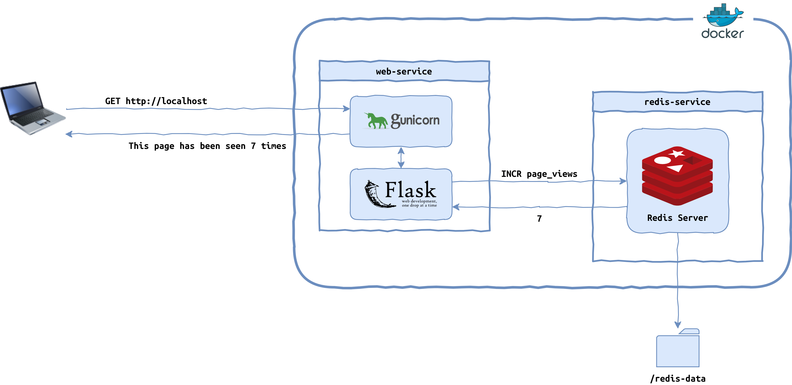

# Page-tracker-CI

# Dev

**Install dependencies for development purposes**

- `pip install --editable ".[dev]"` OR,
  - `pip install - ".[dev]"`

**Run tests**

- `python -m pytest -v test/unit/`
- `pytest -v test/e2e/ --flask-url http://127.0.0.1:5000 --redis-url redis://127.0.0.1:6379`
